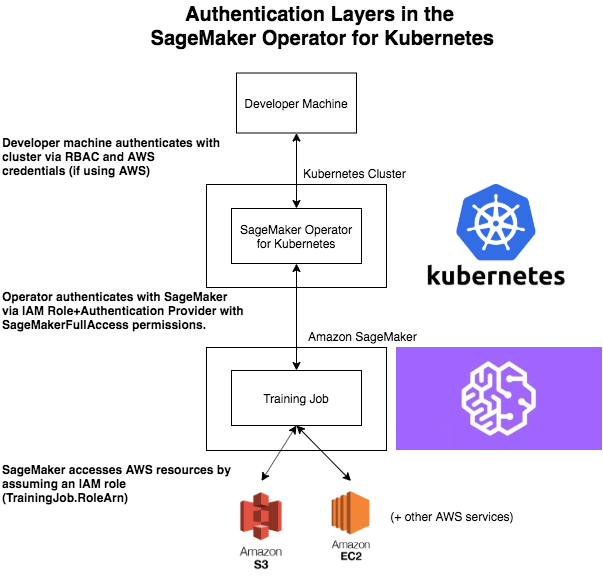

#########################################
Amazon SageMaker Operators for Kubernetes
#########################################

Amazon SageMaker Operators for Kubernetes make it easier for developers and data scientists using Kubernetes to train, tune, and deploy machine learning (ML) models in Amazon SageMaker. You can install these SageMaker Operators on your Kubernetes cluster in Amazon Elastic Kubernetes Service (EKS) to create SageMaker jobs natively using the Kubernetes API and command-line Kubernetes tools such as ‘kubectl’. This guide shows you how to set up the operators. The guide also explains how to use the operators to run model training, hyperparameter tuning, and inference (real-time and batch).

There is no additional charge to use these operators. You do incur charges
for any Amazon SageMaker resources that you use through these operators. The procedures and guidelines here assume you are familiar with Kubernetes and its basic commands.

.. contents::

What is an operator?
--------------------

Kubernetes is built on top of what is called the controller pattern.
This pattern allows applications and tools to listen to a central state
manager (ETCD) and act when something happens. Examples of such
applications
include ``cloud-controller-manager`` and ``controller-manager``.
The controller pattern allows you to create decoupled experiences and not
have to worry about how other components are integrated. To add new capabilities to Kubernetes, developers can extend the Kubernetes API by creating a custom resource that contains their application-specific or domain-specific logic and components. Operators in Kubernetes allow users to natively invoke these custom resources and automate associated workflows.

Prerequisites
~~~~~~~~~~~~~

This guide assumes that you’ve
completed the following prerequisites:

-  Installed the following tools on the client machine used to access your k8s cluster:

   -  `kubectl <https://docs.aws.amazon.com/eks/latest/userguide/install-kubectl.html>`__
      Version 1.13 or later. Use a ``kubectl`` version that is within
      one minor version of your Amazon Elastic Kubernetes Service
      (Amazon EKS) cluster control plane. For example, a
      1.13 ``kubectl`` client works with Kubernetes 1.13 and 1.14
      clusters. OpenID Connect (OIDC) is not supported in versions earlier than 1.13.

   -  `eksctl <https://github.com/weaveworks/eksctl>`__ Version 0.7.0 or
      later

   -  `AWS
      CLI <https://docs.aws.amazon.com/cli/latest/userguide/install-cliv1.html>`__ Version
      1.16.232 or later

   -  (optional) `Helm <https://helm.sh/docs/intro/install/>`__ Version
      3.0 or later

   -  `aws-iam-authenticator <https://docs.aws.amazon.com/eks/latest/userguide/install-aws-iam-authenticator.html>`__ 

-  Have IAM permissions to create roles and attach policies to roles.

-  Created a Kubernetes cluster to run the operators on. It should either be
   Kubernetes version 1.13 or 1.14. For automated cluster
   creation using ``eksctl``, see `Getting Started with eksctl <https://docs.aws.amazon.com/eks/latest/userguide/getting-started-eksctl.html>`__.
   It takes 20 to 30 minutes to provision a cluster.

Permissions overview
~~~~~~~~~~~~~~~~~~~~

The Amazon SageMaker Operators for Kubernetes allow you to manage jobs
in Amazon SageMaker from your Kubernetes cluster. Thus the operators
will access Amazon SageMaker resources on your behalf. The
IAM role that the operator assumes to interact with AWS resources differs
from the credentials you use to access the Kubernetes cluster. The
role also differs from the role that Amazon SageMaker assumes when running your machine learning
jobs. The following image explains this design and flow.

IAM role-based setup and operator deployment
--------------------------------------------

The following sections describe the steps to setup and deploy the
operator.

Cluster-scoped deployment
~~~~~~~~~~~~~~~~~~~~~~~~~

Before you can deploy your operator using an IAM role, associate an OpenID Connect (OIDC) provider with your role to
authenticate with the IAM service.

Create an OpenID Connect Provider for Your Cluster
^^^^^^^^^^^^^^^^^^^^^^^^^^^^^^^^^^^^^^^^^^^^^^^^^^

The following instruction will create and associate an OIDC provider
with your EKS cluster.

Set the local ``CLUSTER_NAME`` and ``AWS_REGION`` environment
variables as follows:

::

    # Set the Region and cluster
    export CLUSTER_NAME="<your cluster name>"
    export AWS_REGION="<your region>"

Use the following command to associate the OIDC provider with your
cluster. For more information, see `Enabling IAM Roles for Service
Accounts on your
Cluster. <https://docs.aws.amazon.com/eks/latest/userguide/enable-iam-roles-for-service-accounts.html>`__

::

    eksctl utils associate-iam-oidc-provider --cluster ${CLUSTER_NAME} \
        --region ${AWS_REGION} --approve

Your output should look like the following:

::

    [_]  eksctl version 0.10.1
    [_]  using region us-east-1
    [_]  IAM OpenID Connect provider is associated with cluster "my-cluster" in "us-east-1"

Now that the cluster has an OIDC identity provider, you can create a
role and give a Kubernetes ServiceAccount permission to assume the role.

Get the OIDC ID
^^^^^^^^^^^^^^^

To set up the ServiceAccount, first obtain the OpenID Connect issuer URL
using the following command:

::

    aws eks describe-cluster --name ${CLUSTER_NAME} --region ${AWS_REGION} \
        --query cluster.identity.oidc.issuer --output text

The command will return a URL like the following:

::

    https://oidc.eks.${AWS_REGION}.amazonaws.com/id/D48675832CA65BD10A532F597OIDCID

In this URL, the value D48675832CA65BD10A532F597OIDCID is the OIDC ID.
The OIDC ID for your cluster will be different. You need this OIDC ID
value to create a role.

If your output is ``None``, it means that your client version is old.
To work around this, run the following command: 

::

    aws eks describe-cluster --query cluster --name ${CLUSTER_NAME} --output text | grep OIDC

The OIDC URL will be returned as follows:

::

    OIDC https://oidc.eks.us-east-1.amazonaws.com/id/D48675832CA65BD10A532F597OIDCID

Create an IAM Role 
^^^^^^^^^^^^^^^^^^^

Create a file named ``trust.json``  and insert the following trust
relationship code block into it. Be sure to replace all ``<OIDC ID>``, ``<AWS account number>``, and ``<EKS Cluster region>`` placeholders with values corresponding to your cluster.

::

    {
      "Version": "2012-10-17",
      "Statement": [
        {
          "Effect": "Allow",
          "Principal": {
            "Federated": "arn:aws:iam::<AWS account number>:oidc-provider/oidc.eks.<EKS Cluster region>.amazonaws.com/id/<OIDC ID>"
          },
          "Action": "sts:AssumeRoleWithWebIdentity",
          "Condition": {
            "StringEquals": {
              "oidc.eks.<EKS Cluster region>.amazonaws.com/id/<OIDC ID>:aud": "sts.amazonaws.com",
              "oidc.eks.<EKS Cluster region>.amazonaws.com/id/<OIDC ID>:sub": "system:serviceaccount:sagemaker-k8s-operator-system:sagemaker-k8s-operator-default"
            }
          }
        }
      ]
    }

Run the following command to create a role with the trust
relationship defined in ``trust.json``. This role enables the
Amazon EKS cluster to get and refresh credentials from IAM.

::

    aws iam create-role --role-name <role name> --assume-role-policy-document file://trust.json --output=text

Your output should look like the following:

::

    ROLE    arn:aws:iam::123456789012:role/my-role 2019-11-22T21:46:10Z    /       ABCDEFSFODNN7EXAMPLE   my-role
    ASSUMEROLEPOLICYDOCUMENT        2012-10-17
    STATEMENT       sts:AssumeRoleWithWebIdentity   Allow
    STRINGEQUALS    sts.amazonaws.com       system:serviceaccount:sagemaker-k8s-operator-system:sagemaker-k8s-operator-default
    PRINCIPAL       arn:aws:iam::123456789012:oidc-provider/oidc.eks.us-east-1.amazonaws.com/id/

Take note of ``ROLE ARN``, you pass this value to your
operator. 

Attach the AmazonSageMakerFullAccess Policy to the Role
^^^^^^^^^^^^^^^^^^^^^^^^^^^^^^^^^^^^^^^^^^^^^^^^^^^^^^^

To give the role access to Amazon SageMaker, attach
the `AmazonSageMakerFullAccess <https://console.aws.amazon.com/iam/home?#/policies/arn:aws:iam::aws:policy/AmazonSageMakerFullAccess>`__ policy.
If you want to limit permissions to the operator, you can create your
own custom policy and attach it.

To attach AmazonSageMakerFullAccess, run the following command:

::

    aws iam attach-role-policy --role-name <role name>  --policy-arn arn:aws:iam::aws:policy/AmazonSageMakerFullAccess

The Kubernetes
ServiceAccount ``sagemaker-k8s-operator-default`` should
have ``AmazonSageMakerFullAccess`` permissions. Confirm this when you
install the operator.

Deploy the Operator
^^^^^^^^^^^^^^^^^^^

When deploying your operator, you can use either a YAML file or Helm
charts. 

Deploy the Operator Using YAML
''''''''''''''''''''''''''''''

This is the simplest way to deploy your operators. The process is as
follows: 

-  Download the installer script using the following command:

   ::

       wget https://raw.githubusercontent.com/aws/amazon-sagemaker-operator-for-k8s/master/release/rolebased/installer.yaml

-  Edit the ``installer.yaml`` file to
   replace ``eks.amazonaws.com/role-arn``. Replace the ARN here with
   the Amazon Resource Name (ARN) for the OIDC-based role you’ve created. 

-  Use the following command to deploy the cluster:  

   ::

       kubectl apply -f installer.yaml

Deploy the Operator Using Helm Charts
'''''''''''''''''''''''''''''''''''''

Use the provided Helm Chart to install
the operator.

Clone the Helm installer directory using the following command:

::

    git clone https://github.com/aws/amazon-sagemaker-operator-for-k8s.git

Navigate to the
``amazon-sagemaker-operator-for-k8s/hack/charts/installer`` folder. Edit
the ``rolebased/values.yaml`` file, which includes high-level parameters for the
Chart. Replace the role ARN here with the Amazon Resource Name (ARN) for the OIDC-based role you’ve
created. 

Install the Helm Chart using the following command:

::

    kubectl create namespace sagemaker-k8s-operator-system
    helm install --namespace sagemaker-k8s-operator-system sagemaker-operator rolebased/

.. warning::
    If you decide to install the operator into a namespace other than the one specified above,
    you will need to adjust the namespace defined in the IAM role ``trust.json`` file to match.

After a moment, the chart will be installed with a randomly generated
name. Verify that the installation succeeded by running the following
command:

::

    helm ls

Your output should look like the following:

::

    NAME                    NAMESPACE                       REVISION        UPDATED                                 STATUS          CHART                           APP VERSION
    sagemaker-operator      sagemaker-k8s-operator-system   1               2019-11-20 23:14:59.6777082 +0000 UTC   deployed        sagemaker-k8s-operator-0.1.0

Verify the operator deployment
^^^^^^^^^^^^^^^^^^^^^^^^^^^^^^
You should be able to see the Amazon SageMaker Custom Resource
Definitions (CRDs) for each operator deployed to your cluster by running
the following command: 

::

    kubectl get crd | grep sagemaker

Your output should look like the following:

::

    batchtransformjobs.sagemaker.aws.amazon.com         2019-11-20T17:12:34Z
    endpointconfigs.sagemaker.aws.amazon.com            2019-11-20T17:12:34Z
    hostingdeployments.sagemaker.aws.amazon.com         2019-11-20T17:12:34Z
    hyperparametertuningjobs.sagemaker.aws.amazon.com   2019-11-20T17:12:34Z
    models.sagemaker.aws.amazon.com                     2019-11-20T17:12:34Z
    trainingjobs.sagemaker.aws.amazon.com               2019-11-20T17:12:34Z

Ensure that the operator pod is running successfully. Use the following
command to list all pods:

::

    kubectl -n sagemaker-k8s-operator-system get pods

You should see a pod
named ``sagemaker-k8s-operator-controller-manager-*****`` in the
namespace ``sagemaker-k8s-operator-system``  as follows:

::

    NAME                                                         READY   STATUS    RESTARTS   AGE
    sagemaker-k8s-operator-controller-manager-12345678-r8abc     2/2     Running   0          23s
    
​

Namespace-scoped deployment
~~~~~~~~~~~~~~~~~~~~~~~~~~~

You have the option to install your operator within the scope of an individual Kubernetes namespace. In this mode, the controller will only monitor and reconcile resources with Amazon SageMaker if the resources are created within that namespace. This allows for finer grained control over which controller is managing which resources. This is useful for deploying to multiple AWS accounts or controlling which users have access to particular jobs.

This guide outlines how to install an operator into a particular, predefined namespace. To deploy a controller into a second namespace, follow the guide from beginning to end and change out the namespace in each step.

Create an OpenID Connect Provider for Your EKS Cluster
^^^^^^^^^^^^^^^^^^^^^^^^^^^^^^^^^^^^^^^^^^^^^^^^^^^^^^

The following instruction will create and associate an OIDC provider
with your EKS cluster.

Set the local ``CLUSTER_NAME`` and ``AWS_REGION`` environment
variables as follows:

.. code:: shell

    # Set the region and cluster
    export CLUSTER_NAME="<your cluster name>"
    export AWS_REGION="<your region>"

Use the following command to associate the OIDC provider with your
cluster. For more information, see \ `Enabling IAM Roles for Service
Accounts on your
Cluster. <https://docs.aws.amazon.com/eks/latest/userguide/enable-iam-roles-for-service-accounts.html>`__

::

    eksctl utils associate-iam-oidc-provider --cluster ${CLUSTER_NAME} \
        --region ${AWS_REGION} --approve

Your output should look like the following:

::

    [_]  eksctl version 0.10.1
    [_]  using region us-east-1
    [_]  IAM OpenID Connect provider is associated with cluster "my-cluster" in "us-east-1"

Now that the cluster has an OIDC identity provider, you can create a
role and give a Kubernetes ServiceAccount permission to assume the role.

Get your OIDC ID
^^^^^^^^^^^^^^^^

To set up the ServiceAccount, first obtain the OpenID Connect issuer URL
using the following command:

::

    aws eks describe-cluster --name ${CLUSTER_NAME} --region ${AWS_REGION} \
        --query cluster.identity.oidc.issuer --output text

The command will return a URL like the following:

::

    https://oidc.eks.${AWS_REGION}.amazonaws.com/id/D48675832CA65BD10A532F597OIDCID

In this URL, the value D48675832CA65BD10A532F597OIDCID is the OIDC ID.
The OIDC ID for your cluster will be different. You need this OIDC ID
value to create a role.

If your output is ``None``, it means that your client version is old.
To work around this, run the following command: 

::

    aws eks describe-cluster --query cluster --name ${CLUSTER_NAME} --output text | grep OIDC

The OIDC URL will be returned as follows:

::

    OIDC https://oidc.eks.us-east-1.amazonaws.com/id/D48675832CA65BD10A532F597OIDCID

Create your IAM Role 
^^^^^^^^^^^^^^^^^^^^

Create a file named ``trust.json``  and insert the following trust
relationship code block into it. Be sure to replace all ``<OIDC ID>``, ``<AWS account number>``, ``<EKS Cluster region>``, and ``<Namespace>`` placeholders with values corresponding to your cluster. For the purposes of this guide, ``my-namespace`` is used for the ``<Namespace>`` value.

::

    {
      "Version": "2012-10-17",
      "Statement": [
        {
          "Effect": "Allow",
          "Principal": {             
            "Federated": "arn:aws:iam::<AWS account number>:oidc-provider/oidc.eks.<EKS Cluster region>.amazonaws.com/id/<OIDC ID>"
          },
          "Action": "sts:AssumeRoleWithWebIdentity",
          "Condition": {
            "StringEquals": {
              "oidc.eks.<EKS Cluster region>.amazonaws.com/id/<OIDC ID>:aud": "sts.amazonaws.com",
              "oidc.eks.<EKS Cluster region>.amazonaws.com/id/<OIDC ID>:sub": "system:serviceaccount:<Namespace>:sagemaker-k8s-operator-default"
            }
          }
        }
      ]
    }

Run the following command to create a role with the trust
relationship defined in ``trust.json``. This role enables the
Amazon EKS cluster to get and refresh credentials from IAM.

::

    aws iam create-role --role-name <role name> --assume-role-policy-document file://trust.json --output=text

Your output should look like the following:

::

    ROLE    arn:aws:iam::123456789012:role/my-role 2019-11-22T21:46:10Z    /       ABCDEFSFODNN7EXAMPLE   my-role
    ASSUMEROLEPOLICYDOCUMENT        2012-10-17
    STATEMENT       sts:AssumeRoleWithWebIdentity   Allow
    STRINGEQUALS    sts.amazonaws.com       system:serviceaccount:my-namespace:sagemaker-k8s-operator-default
    PRINCIPAL       arn:aws:iam::123456789012:oidc-provider/oidc.eks.us-east-1.amazonaws.com/id/

Take note of ``ROLE ARN``, you pass this value to your
operator. 

Attach the AmazonSageMakerFullAccess Policy to your Role
^^^^^^^^^^^^^^^^^^^^^^^^^^^^^^^^^^^^^^^^^^^^^^^^^^^^^^^^

To give the role access to Amazon SageMaker, attach
the \ `AmazonSageMakerFullAccess <https://console.aws.amazon.com/iam/home?#/policies/arn:aws:iam::aws:policy/AmazonSageMakerFullAccess>`__ policy.
If you want to limit permissions to the operator, you can create your
own custom policy and attach it.

To attach AmazonSageMakerFullAccess, run the following command:

::

    aws iam attach-role-policy --role-name <role name>  --policy-arn arn:aws:iam::aws:policy/AmazonSageMakerFullAccess

The Kubernetes
ServiceAccount ``sagemaker-k8s-operator-default`` should
have ``AmazonSageMakerFullAccess`` permissions. Confirm this when you
install the operator.

Deploy the Operator to Your Namespace
^^^^^^^^^^^^^^^^^^^^^^^^^^^^^^^^^^^^^

When deploying your operator, you can use either a YAML file or Helm
charts. 

Deploy the Operator to Your Namespace Using YAML
''''''''''''''''''''''''''''''''''''''''''''''''

There are two parts to deploying an operator within the scope of a namespace. The first is the set of CRDs that are installed at a cluster level. These resource definitions only need to be installed once per Kubernetes cluster. The second part is the operator permissions and deployment itself.

If you have not already installed the CRDs into the cluster, apply the CRD installer YAML using the following command:

::

    kubectl apply -f https://raw.githubusercontent.com/aws/amazon-sagemaker-operator-for-k8s/master/release/rolebased/namespaced/crd.yaml
    
To install the operator onto the cluster:

-  Download the operator installer YAML using the following command:

   ::

       wget https://raw.githubusercontent.com/aws/amazon-sagemaker-operator-for-k8s/master/release/rolebased/namespaced/operator.yaml

- Update the installer YAML to place the resources into your specified namespace using the following command:
    ::
   
       sed -i -e 's/PLACEHOLDER-NAMESPACE/<YOUR NAMESPACE>/g' operator.yaml

-  Edit the ``operator.yaml`` file to
   place resources into your ``eks.amazonaws.com/role-arn``. Replace the ARN here with
   the Amazon Resource Name (ARN) for the OIDC-based role you’ve created. 

-  Use the following command to deploy the cluster:  

   ::

       kubectl apply -f operator.yaml

Deploy the Operator to Your Namespace Using Helm Charts
'''''''''''''''''''''''''''''''''''''''''''''''''''''''

There are two parts needed to deploy an operator within the scope of a namespace. The first is the set of CRDs that are installed at a cluster level. These resource definitions only need to be installed once per Kubernetes cluster. The second part is the operator permissions and deployment itself. When using helm charts you will have to first create the namespace using kubectl.

Clone the Helm installer directory using the following command:

::

    git clone https://github.com/aws/amazon-sagemaker-operator-for-k8s.git

Navigate to the
``amazon-sagemaker-operator-for-k8s/hack/charts/installer/namespaced`` folder. Edit
the ``rolebased/values.yaml`` file, which includes high-level parameters for the
Chart. Replace the role ARN here with the Amazon Resource Name (ARN) for the OIDC-based role you’ve
created. 

Install the Helm Chart using the following command:

::

    helm install crds crd_chart/

Create the required namespace and install the operator using the following command:

::

    kubectl create namespace <namespace>
    helm install --n <namespace> op operator_chart/

After a moment, the chart will be installed with the
name ``sagemaker-operator``. Verify that the installation succeeded by running the following
command:

::

    helm ls

Your output should look like the following:

::

    NAME                    NAMESPACE                       REVISION        UPDATED                                 STATUS          CHART                           APP VERSION
    sagemaker-operator      my-namespace                    1               2019-11-20 23:14:59.6777082 +0000 UTC   deployed        sagemaker-k8s-operator-0.1.0

Verify the operator deployment to your namespace
^^^^^^^^^^^^^^^^^^^^^^^^^^^^^^^^^^^^^^^^^^^^^^^^
You should be able to see the Amazon SageMaker Custom Resource
Definitions (CRDs) for each operator deployed to your cluster by running
the following command: 

::

    kubectl get crd | grep sagemaker

Your output should look like the following:

::

    batchtransformjobs.sagemaker.aws.amazon.com         2019-11-20T17:12:34Z
    endpointconfigs.sagemaker.aws.amazon.com            2019-11-20T17:12:34Z
    hostingdeployments.sagemaker.aws.amazon.com         2019-11-20T17:12:34Z
    hyperparametertuningjobs.sagemaker.aws.amazon.com   2019-11-20T17:12:34Z
    models.sagemaker.aws.amazon.com                     2019-11-20T17:12:34Z
    trainingjobs.sagemaker.aws.amazon.com               2019-11-20T17:12:34Z

Ensure that the operator pod is running successfully. Use the following
command to list all pods:

::

    kubectl -n my-namespace get pods

You should see a pod
named ``sagemaker-k8s-operator-controller-manager-*****`` in the
namespace ``my-namespace``  as follows:

::

    NAME                                                         READY   STATUS    RESTARTS   AGE
    sagemaker-k8s-operator-controller-manager-12345678-r8abc     2/2     Running   0          23s

​

Install the Amazon SageMaker logs \ ``kubectl`` plugin
~~~~~~~~~~~~~~~~~~~~~~~~~~~~~~~~~~~~~~~~~~~~~~~~~~~~~~

As part of the Amazon SageMaker Operators for Kubernetes, you can use
the ``smlogs`` `plugin <https://kubernetes.io/docs/tasks/extend-kubectl/kubectl-plugins/>`__ for ``kubectl`` .
This enables Amazon SageMaker CloudWatch logs to be streamed
with ``kubectl``. ``kubectl`` must be installed onto
your `PATH <http://www.linfo.org/path_env_var.html>`__. The
following commands place the binary in
the ``sagemaker-k8s-bin`` directory in your home directory, and add
that directory to your ``PATH``.

::

    export os="linux"

    wget https://amazon-sagemaker-operator-for-k8s-us-east-1.s3.amazonaws.com/kubectl-smlogs-plugin/v1/${os}.amd64.tar.gz
    tar xvzf ${os}.amd64.tar.gz

    # Move binaries to a directory in your homedir.
    mkdir ~/sagemaker-k8s-bin
    cp ./kubectl-smlogs.${os}.amd64/kubectl-smlogs ~/sagemaker-k8s-bin/.

    # This line will add the binaries to your PATH in your .bashrc. 

    echo 'export PATH=$PATH:~/sagemaker-k8s-bin' >> ~/.bashrc

    # Source your .bashrc to update environment variables:
    source ~/.bashrc

Use the following command to verify that the ``kubectl`` plugin is
installed correctly:

::

    kubectl smlogs

If the ``kubectl`` plugin is installed correctly, your output should
look like the following:

::

    View Amazon SageMaker logs via Kubernetes

    Usage:
      smlogs [command]

    Aliases:
      smlogs, SMLogs, Smlogs

    Available Commands:
      BatchTransformJob       View BatchTransformJob logs via Kubernetes
      TrainingJob             View TrainingJob logs via Kubernetes
      help                    Help about any command

    Flags:
      -h, --help   help for smlogs

    Use "smlogs [command] --help" for more information about a command.

Delete operators from the cluster 
----------------------------------

Operators installed using YAML
~~~~~~~~~~~~~~~~~~~~~~~~~~~~~~

To uninstall the operator from your cluster, make sure that all
Amazon SageMaker resources have been deleted from the cluster. Failure
to do so will cause the operator delete operation to hang. Once you have
deleted all Amazon SageMaker jobs, use ``kubectl`` to
delete the operator from the cluster. Run the following commands to stop
all jobs and delete the operator from the cluster:

::

    # Delete all Amazon SageMaker jobs from Kubernetes
    kubectl delete --all --all-namespaces hyperparametertuningjob.sagemaker.aws.amazon.com
    kubectl delete --all --all-namespaces trainingjobs.sagemaker.aws.amazon.com
    kubectl delete --all --all-namespaces batchtransformjob.sagemaker.aws.amazon.com
    kubectl delete --all --all-namespaces hostingdeployment.sagemaker.aws.amazon.com

    # Delete the operator and its resources
    kubectl delete -f /installer.yaml

You should see output like the following:

::

    $ kubectl delete --all --all-namespaces trainingjobs.sagemaker.aws.amazon.com
    trainingjobs.sagemaker.aws.amazon.com "xgboost-mnist-from-for-s3" deleted

    $ kubectl delete --all --all-namespaces hyperparametertuningjob.sagemaker.aws.amazon.com
    hyperparametertuningjob.sagemaker.aws.amazon.com "xgboost-mnist-hpo" deleted

    $ kubectl delete --all --all-namespaces batchtransformjob.sagemaker.aws.amazon.com
    batchtransformjob.sagemaker.aws.amazon.com "xgboost-mnist" deleted

    $ kubectl delete --all --all-namespaces hostingdeployment.sagemaker.aws.amazon.com
    hostingdeployment.sagemaker.aws.amazon.com "host-xgboost" deleted

    $ kubectl delete -f raw-yaml/installer.yaml
    namespace "sagemaker-k8s-operator-system" deleted
    customresourcedefinition.apiextensions.k8s.io "batchtransformjobs.sagemaker.aws.amazon.com" deleted
    customresourcedefinition.apiextensions.k8s.io "endpointconfigs.sagemaker.aws.amazon.com" deleted
    customresourcedefinition.apiextensions.k8s.io "hostingdeployments.sagemaker.aws.amazon.com" deleted
    customresourcedefinition.apiextensions.k8s.io "hyperparametertuningjobs.sagemaker.aws.amazon.com" deleted
    customresourcedefinition.apiextensions.k8s.io "models.sagemaker.aws.amazon.com" deleted
    customresourcedefinition.apiextensions.k8s.io "trainingjobs.sagemaker.aws.amazon.com" deleted
    role.rbac.authorization.k8s.io "sagemaker-k8s-operator-leader-election-role" deleted
    clusterrole.rbac.authorization.k8s.io "sagemaker-k8s-operator-manager-role" deleted
    clusterrole.rbac.authorization.k8s.io "sagemaker-k8s-operator-proxy-role" deleted
    rolebinding.rbac.authorization.k8s.io "sagemaker-k8s-operator-leader-election-rolebinding" deleted
    clusterrolebinding.rbac.authorization.k8s.io "sagemaker-k8s-operator-manager-rolebinding" deleted
    clusterrolebinding.rbac.authorization.k8s.io "sagemaker-k8s-operator-proxy-rolebinding" deleted
    service "sagemaker-k8s-operator-controller-manager-metrics-service" deleted
    deployment.apps "sagemaker-k8s-operator-controller-manager" deleted
    secrets "sagemaker-k8s-operator-abcde" deleted

Operators installed using Helm Charts
~~~~~~~~~~~~~~~~~~~~~~~~~~~~~~~~~~~~~

To delete the operator CRDs, first delete all the running jobs. Then
delete the helm chart that was used to deploy the operators using the
following commands: 

::

    # get the helm charts 
    $ helm ls

    # delete the charts
    $ helm delete <chart name>

​

Troubleshooting
---------------

Debugging a Failed Job
~~~~~~~~~~~~~~~~~~~~~~

Check the job status by running:

::

    kubectl get <CRD Type> <job name>

If the job was created in Amazon SageMaker, you can use the following
command to see the ``STATUS`` and the ``SageMaker Job Name``: 

::

    kubectl get <crd type> <job name>

-  You can use ``smlogs`` to find the cause of the issue using the
   following command: 

   ::

       kubectl smlogs <crd type> <job name>

-  You can also use the ``describe`` command to get more details about
   the job using the following command.The output will have
   an ``additional`` field that will have more information about the
   status of the job.

   ::

       kubectl describe <crd type> <job name>

If the job was not created in Amazon SageMaker, then use the logs of the
operator’s pod to find the cause of the issue as follows:

::

    $ kubectl get pods -A | grep sagemaker
    # Output: 
    sagemaker-k8s-operator-system   sagemaker-k8s-operator-controller-manager-5cd7df4d74-wh22z   2/2     Running   0          3h33m

    $ kubectl logs -p <pod name> -c manager -n sagemaker-k8s-operator-system

Deleting an Operator CRD
~~~~~~~~~~~~~~~~~~~~~~~~

If deleting a job is stuck, check if the operator is running. If the
operator is not running, then you will have to delete the finalizer
using the following steps:

-  In a new terminal, open the job in an editor using ``kubectl edit``
   as follows: 

   ::

       $ kubectl edit <crd type> <job name>

       # for example for the batchtransformjob xgboost-mnist
       $ kubectl edit batchtransformjobs xgboost-mnist 

-  Edit the job to delete the finalizer by removing the following two
   lines from the file. Save the file and the job should immediately get
   deleted/updated. 

   ::

         finalizers:
         - sagemaker-operator-finalizer

Images and SMlogs in each Region
--------------------------------

The following table lists the available operator images and SMLogs in
each region.

+-------------+---------------------------------------------------------------------------------------------+------------------------------------------------------------------------------------------------------------------------+
| Region      | Controller Image                                                                            | Linux SMLogs                                                                                                           |
+=============+=============================================================================================+========================================================================================================================+
| us-east-1   | ``957583890962.dkr.ecr.us-east-1.amazonaws.com/amazon-sagemaker-operator-for-k8s:v1``       | https://amazon-sagemaker-operator-for-k8s-us-east-1.s3.amazonaws.com/kubectl-smlogs-plugin/v1/linux.amd64.tar.gz       |
+-------------+---------------------------------------------------------------------------------------------+------------------------------------------------------------------------------------------------------------------------+
| us-east-2   | ``922499468684.dkr.ecr.us-east-2.amazonaws.com/amazon-sagemaker-operator-for-k8s:v1``       | https://amazon-sagemaker-operator-for-k8s-us-east-2.s3.amazonaws.com/kubectl-smlogs-plugin/v1/linux.amd64.tar.gz       |
+-------------+---------------------------------------------------------------------------------------------+------------------------------------------------------------------------------------------------------------------------+
| us-west-2   | ``640106867763.dkr.ecr.us-west-2.amazonaws.com/amazon-sagemaker-operator-for-k8s:v1``       | https://amazon-sagemaker-operator-for-k8s-us-west-2.s3.amazonaws.com/kubectl-smlogs-plugin/v1/linux.amd64.tar.gz       |
+-------------+---------------------------------------------------------------------------------------------+------------------------------------------------------------------------------------------------------------------------+
| eu-west-1   | ``613661167059.dkr.ecr.eu-west-1.amazonaws.com/amazon-sagemaker-operator-for-k8s:v1``       | https://amazon-sagemaker-operator-for-k8s-eu-west-1.s3.amazonaws.com/kubectl-smlogs-plugin/v1/linux.amd64.tar.gz       |
+-------------+---------------------------------------------------------------------------------------------+------------------------------------------------------------------------------------------------------------------------+

Using Amazon Sagemaker Jobs
---------------------------

To run a job using the Amazon Sagemaker Operators for Kubernetes, you can either apply
a YAML file or use the supplied Helm charts.

All operator sample jobs in the following tutorials use sample data
taken from a public MNIST dataset. In order to run these samples, download the dataset into your S3 bucket. You can find
the dataset in `Download the MNIST
Dataset. <https://docs.aws.amazon.com/sagemaker/latest/dg/ex1-preprocess-data-pull-data.html>`__

.. contents::

TrainingJob operator
~~~~~~~~~~~~~~~~~~~~

Training job operators reconcile your specified training job spec to
Amazon SageMaker by launching it for you in Amazon SageMaker. You can
learn more about Amazon SageMaker training jobs in the Amazon
SageMaker `CreateTrainingJob API
documentation <https://docs.aws.amazon.com/sagemaker/latest/dg/API_CreateTrainingJob.html>`__.

Create a TrainingJob Using a Simple YAML File
^^^^^^^^^^^^^^^^^^^^^^^^^^^^^^^^^^^^^^^^^^^^^

Download the sample YAML file for training using the following command: 

::

    wget https://raw.githubusercontent.com/aws/amazon-sagemaker-operator-for-k8s/master/samples/xgboost-mnist-trainingjob.yaml

Edit the ``xgboost-mnist-trainingjob.yaml`` file to replace the ``roleArn`` parameter with your ``<sagemaker-execution-role>``, and ``outputPath`` with your S3 bucket that the Amazon SageMaker
execution role has write access to. The ``roleArn`` must have permissions so that Amazon SageMaker
can access Amazon S3, Amazon CloudWatch, and other services on your 
behalf. For more information on creating an Amazon SageMaker
ExecutionRole, see `Amazon SageMaker
Roles <https://docs.aws.amazon.com/sagemaker/latest/dg/sagemaker-roles.html#sagemaker-roles-createtrainingjob-perms>`__.
Apply the YAML file using the
following command:

::

    kubectl apply -f xgboost-mnist-trainingjob.yaml

Create a TrainingJob Using a Helm Chart
^^^^^^^^^^^^^^^^^^^^^^^^^^^^^^^^^^^^^^^

You can use Helm Charts to run TrainingJobs. 

Clone the github repo to get the source using the following command: 

::

    git clone https://github.com/aws/amazon-sagemaker-operator-for-k8s.git

Navigate to the ``amazon-sagemaker-operator-for-k8s/hack/charts/training-jobs/`` folder
and edit the ``values.yaml`` file to replace values
like ``rolearn`` and ``outputpath`` with values that correspond to
your account. The RoleARN must have permissions so that Amazon SageMaker
can access Amazon S3, Amazon CloudWatch, and other services on your
behalf. For more information on creating an Amazon SageMaker
ExecutionRole, see `Amazon SageMaker
Roles <https://docs.aws.amazon.com/sagemaker/latest/dg/sagemaker-roles.html#sagemaker-roles-createtrainingjob-perms>`__.

Create the Training Job 
''''''''''''''''''''''''

With the roles and S3 buckets replaced with appropriate values
in ``values.yaml``, you can create a training job using the following
command:

::

    helm install . --generate-name

Your output should look like the following:

::

    NAME: chart-12345678
    LAST DEPLOYED: Wed Nov 20 23:35:49 2019
    NAMESPACE: default
    STATUS: deployed
    REVISION: 1
    TEST SUITE: None
    NOTES:
    Thanks for installing the sagemaker-k8s-trainingjob.

Verify Your Training Helm Chart
'''''''''''''''''''''''''''''''

To verify that the Helm Chart was created successfully, run:

::

    helm ls

Your output should look like the following:

::

    NAME                    NAMESPACE       REVISION        UPDATED                                 STATUS          CHART                           APP VERSION
    chart-12345678        default         1               2019-11-20 23:35:49.9136092 +0000 UTC   deployed        sagemaker-k8s-trainingjob-0.1.0
    rolebased-12345678    default         1               2019-11-20 23:14:59.6777082 +0000 UTC   deployed        sagemaker-k8s-operator-0.1.0

``helm install`` creates a ``TrainingJob`` k8s resource. The operator
launches the actual training job in Amazon SageMaker and updates
the ``TrainingJob`` k8s resource to reflect the status of the job in
Amazon SageMaker. You incur charges for Amazon SageMaker resources used
during the duration of your job. You do not incur any charges once your
job completes or stops.

**Note**: Amazon SageMaker does not allow you to update a running
training job. You cannot edit any parameter and re-apply the
file/config. Either change the metadata name or delete the existing job
and create a new one. Similar to existing training job operators like
TFJob in Kubeflow, ``update`` is not supported.

List Training Jobs
^^^^^^^^^^^^^^^^^^

Use the following command to list all jobs created using the k8s
operator:

::

    kubectl get TrainingJob

The output listing all jobs should look like the following:

::

    kubectl get trainingjobs
    NAME                        STATUS       SECONDARY-STATUS   CREATION-TIME          SAGEMAKER-JOB-NAME
    xgboost-mnist-from-for-s3   InProgress   Starting           2019-11-20T23:42:35Z   xgboost-mnist-from-for-s3-examplef11eab94e0ed4671d5a8f

A training job continues to be listed after the job has completed or
failed. You can remove a ``TrainingJob``  job from the list by
following the Delete a Training Job steps. Jobs that have completed or
stopped do not incur any charges for Amazon SageMaker resources. 

Training Job Status Values
''''''''''''''''''''''''''

The ``STATUS`` field can be one of the following values: 

-  ``Completed``

-  ``InProgress``

-  ``Failed``

-  ``Stopped``

-  ``Stopping``

These statuses come directly from the Amazon SageMaker official `API
documentation <https://docs.aws.amazon.com/sagemaker/latest/dg/API_DescribeTrainingJob.html#SageMaker-DescribeTrainingJob-response-TrainingJobStatus>`__.

In addition to the official Amazon SageMaker status, it is possible
for ``STATUS`` to be ``SynchronizingK8sJobWithSageMaker``. This
means that the operator has not yet processed the job.

Secondary Status Values
'''''''''''''''''''''''

The secondary statuses come directly from the Amazon SageMaker
official `API
documentation <https://docs.aws.amazon.com/sagemaker/latest/dg/API_DescribeTrainingJob.html#SageMaker-DescribeTrainingJob-response-SecondaryStatus>`__.
They contain more granular information about the status of the job.

Describe a Training Job
^^^^^^^^^^^^^^^^^^^^^^^

You can get more details about the training job by using
the ``describe`` kubectl verb. This is typically used for debugging a
problem or checking the parameters of a training job. To get information
about your training job, use the following command:

::

    kubectl describe trainingjob xgboost-mnist-from-for-s3

The output for your training job should look like the following:

::

    Name:         xgboost-mnist-from-for-s3
    Namespace:    default
    Labels:       <none>
    Annotations:  <none>
    API Version:  sagemaker.aws.amazon.com/v1
    Kind:         TrainingJob
    Metadata:
      Creation Timestamp:  2019-11-20T23:42:35Z
      Finalizers:
        sagemaker-operator-finalizer
      Generation:        2
      Resource Version:  23119
      Self Link:         /apis/sagemaker.aws.amazon.com/v1/namespaces/default/trainingjobs/xgboost-mnist-from-for-s3
      UID:               6d7uiui-0bef-11ea-b94e-0ed467example
    Spec:
      Algorithm Specification:
        Training Image:       8256416981234.dkr.ecr.us-east-2.amazonaws.com/xgboost:1
        Training Input Mode:  File
      Hyper Parameters:
        Name:   eta
        Value:  0.2
        Name:   gamma
        Value:  4
        Name:   max_depth
        Value:  5
        Name:   min_child_weight
        Value:  6
        Name:   num_class
        Value:  10
        Name:   num_round
        Value:  10
        Name:   objective
        Value:  multi:softmax
        Name:   silent
        Value:  0
      Input Data Config:
        Channel Name:      train
        Compression Type:  None
        Content Type:      text/csv
        Data Source:
          S 3 Data Source:
            S 3 Data Distribution Type:  FullyReplicated
            S 3 Data Type:               S3Prefix
            S 3 Uri:                     https://s3-us-east-2.amazonaws.com/my-bucket/sagemaker/xgboost-mnist/train/
        Channel Name:                    validation
        Compression Type:                None
        Content Type:                    text/csv
        Data Source:
          S 3 Data Source:
            S 3 Data Distribution Type:  FullyReplicated
            S 3 Data Type:               S3Prefix
            S 3 Uri:                     https://s3-us-east-2.amazonaws.com/my-bucket/sagemaker/xgboost-mnist/validation/
      Output Data Config:
        S 3 Output Path:  s3://my-bucket/sagemaker/xgboost-mnist/xgboost/
      Region:             us-east-2
      Resource Config:
        Instance Count:     1
        Instance Type:      ml.m4.xlarge
        Volume Size In GB:  5
      Role Arn:             arn:aws:iam::12345678910:role/service-role/AmazonSageMaker-ExecutionRole
      Stopping Condition:
        Max Runtime In Seconds:  86400
      Training Job Name:         xgboost-mnist-from-for-s3-6d7fa0af0bef11eab94e0example
    Status:
      Cloud Watch Log URL:           https://us-east-2.console.aws.amazon.com/cloudwatch/home?region=us-east-2#logStream:group=/aws/sagemaker/TrainingJobs;prefix=<example>;streamFilter=typeLogStreamPrefix
      Last Check Time:               2019-11-20T23:44:29Z
      Sage Maker Training Job Name:  xgboost-mnist-from-for-s3-6d7fa0af0bef11eab94eexample
      Secondary Status:              Downloading
      Training Job Status:           InProgress
    Events:                          <none>

View Logs from Training Jobs
^^^^^^^^^^^^^^^^^^^^^^^^^^^^

Use the following command to see the logs from the ``kmeans-mnist`` 
training job:

::

    kubectl smlogs trainingjob xgboost-mnist-from-for-s3

Your output will look similar to the following. The logs from instances
are ordered chronologically.

::

    "xgboost-mnist-from-for-s3" has SageMaker TrainingJobName "xgboost-mnist-from-for-s3-123456789" in region "us-east-2", status "InProgress" and secondary status "Starting"
    xgboost-mnist-from-for-s3-6d7fa0af0bef11eab94e0ed46example/algo-1-1574293123 2019-11-20 23:45:24.7 +0000 UTC Arguments: train
    xgboost-mnist-from-for-s3-6d7fa0af0bef11eab94e0ed46example/algo-1-1574293123 2019-11-20 23:45:24.7 +0000 UTC [2019-11-20:23:45:22:INFO] Running standalone xgboost training.
    xgboost-mnist-from-for-s3-6d7fa0af0bef11eab94e0ed46example/algo-1-1574293123 2019-11-20 23:45:24.7 +0000 UTC [2019-11-20:23:45:22:INFO] File size need to be processed in the node: 1122.95mb. Available memory size in the node: 8586.0mb
    xgboost-mnist-from-for-s3-6d7fa0af0bef11eab94e0ed46example/algo-1-1574293123 2019-11-20 23:45:24.7 +0000 UTC [2019-11-20:23:45:22:INFO] Determined delimiter of CSV input is ','
    xgboost-mnist-from-for-s3-6d7fa0af0bef11eab94e0ed46example/algo-1-1574293123 2019-11-20 23:45:24.7 +0000 UTC [23:45:22] S3DistributionType set as FullyReplicated

Delete Training Jobs
^^^^^^^^^^^^^^^^^^^^

Use the following command to stop a training job on Amazon SageMaker:

::

    kubectl delete trainingjob xgboost-mnist-from-for-s3

This command removes the Amazon SageMaker training job from k8s. This
command returns the following output:

::

    trainingjob.sagemaker.aws.amazon.com "xgboost-mnist-from-for-s3" deleted

If the job is still in progress on Amazon SageMaker, the job will stop.
You do not incur any charges for Amazon SageMaker resources after your
job stops or completes. 

**Note**: Amazon SageMaker does not delete training jobs. Stopped jobs
continue to show on the Amazon SageMaker console. The delete command
takes about 2 minutes to clean up the resources from Amazon SageMaker.

HyperParameterTuningJobs operator
~~~~~~~~~~~~~~~~~~~~~~~~~~~~~~~~~

Hyperparameter tuning job operators reconcile your
specified hyperparameter tuning job spec to Amazon SageMaker by
launching it in Amazon SageMaker. You can learn more about Amazon
SageMaker hyperparameter tuning jobs in the Amazon
SageMaker `CreateHyperParameterTuningJob API
documentation <https://docs.aws.amazon.com/sagemaker/latest/dg/API_CreateHyperParameterTuningJob.html>`__.

Create a HyperParameterTuningJob Using a Simple YAML File
^^^^^^^^^^^^^^^^^^^^^^^^^^^^^^^^^^^^^^^^^^^^^^^^^^^^^^^^^

Download the sample YAML file for the hyperparameter tuning job using
the following command: 

::

    wget https://raw.githubusercontent.com/aws/amazon-sagemaker-operator-for-k8s/master/samples/xgboost-mnist-hpo.yaml

Edit the ``xgboost-mnist-hpo.yaml`` file to replace
the ``roleArn`` parameter with your <sagemaker-execution-role>. For
HyperparameterTuningJob to succeed, you must also change
the ``s3InputPath``  and ``s3OutputPath`` to values that correspond
to your account. Apply the updates YAML file using the following
command:

::

    kubectl apply -f xgboost-mnist-hpo.yaml

Create a HyperParameterTuningJob using a Helm Chart
^^^^^^^^^^^^^^^^^^^^^^^^^^^^^^^^^^^^^^^^^^^^^^^^^^^

You can use Helm Charts to run HyperParameterTuningJobs.

Clone the github repo to get the source using the following command: 

::

    git clone https://github.com/aws/amazon-sagemaker-operator-for-k8s.git

Navigate to the ``amazon-sagemaker-operator-for-k8s/hack/charts/hyperparameter-tuning-jobs/``
folder.

Edit the ``values.yaml`` file to replace the ``roleArn`` parameter
with your <sagemaker-execution-role>. For HyperparameterTuningJob to
succeed, you must also change the ``s3InputPath`` 
and ``s3OutputPath`` to values that correspond to your account. 

Create the HPO Job
''''''''''''''''''

With the roles and Amazon S3 paths replaced with appropriate values
in ``values.yaml``, you can create a hyperparameter tuning job using
the following command:

::

    helm install . --generate-name

Your output will look similar to the following:

::

    NAME: chart-1574292948
    LAST DEPLOYED: Wed Nov 20 23:35:49 2019
    NAMESPACE: default
    STATUS: deployed
    REVISION: 1
    TEST SUITE: None
    NOTES:
    Thanks for installing the sagemaker-k8s-hyperparametertuningjob.

Verify Chart Installation
'''''''''''''''''''''''''

To verify that the Helm Chart was created successfully, run the
following command:

::

    helm ls

Your output should look like the following:

::

    NAME                    NAMESPACE       REVISION        UPDATED  
    chart-1474292948        default         1               2019-11-20 23:35:49.9136092 +0000 UTC   deployed        sagemaker-k8s-hyperparametertuningjob-0.1.0                               STATUS          CHART                           APP VERSION
    chart-1574292948        default         1               2019-11-20 23:35:49.9136092 +0000 UTC   deployed        sagemaker-k8s-trainingjob-0.1.0
    rolebased-1574291698    default         1               2019-11-20 23:14:59.6777082 +0000 UTC   deployed        sagemaker-k8s-operator-0.1.0

``helm install`` creates a ``HyperParameterTuningJob`` k8s resource.
The operator launches the actual hyperparameter optimization job in
Amazon SageMaker and updates the ``HyperParameterTuningJob`` k8s
resource to reflect the status of the job in Amazon SageMaker. You incur
charges for Amazon SageMaker resources used during the duration of your
job. You do not incur any charges once your job completes or stops.

**Note**: Amazon SageMaker does not allow you to update a running
hyperparameter tuning job. You cannot edit any parameter and re-apply
the file/config. You must either change the metadata name or delete the
existing job and create a new one. Similar to existing training job
operators like TFJob in Kubeflow, ``update`` is not supported.

List Hyperparameter Tuning Jobs
^^^^^^^^^^^^^^^^^^^^^^^^^^^^^^^

Use the following command to list all jobs created using the k8s
operator:

::

    kubectl get hyperparametertuningjob 

Your output will look like the following:

::

    NAME         STATUS      CREATION-TIME          COMPLETED   INPROGRESS   ERRORS   STOPPED   BEST-TRAINING-JOB                               SAGEMAKER-JOB-NAME
    xgboost-mnist-hpo   Completed   2019-10-17T01:15:52Z   10          0            0        0         xgboostha92f5e3cf07b11e9bf6c06d6-009-4c7a123   xgboostha92f5e3cf07b11e9bf6c123

A hyper parameter tuning job will continue to be listed after the job
has completed or failed. You can remove a ``hyperparametertuningjob`` 
from the list by following the steps in Delete a Hyper Parameter Tuning
Job. Jobs that have completed or stopped do not incur any charges for
Amazon SageMaker resources. 

Hyperparameter Tuning Job Status Values
'''''''''''''''''''''''''''''''''''''''

The ``STATUS`` field can be one of the following values: 

-  ``Completed``

-  ``InProgress``

-  ``Failed``

-  ``Stopped``

-  ``Stopping``

These statuses come directly from the Amazon SageMaker official `API
documentation <https://docs.aws.amazon.com/sagemaker/latest/dg/API_DescribeHyperParameterTuningJob.html#SageMaker-DescribeHyperParameterTuningJob-response-HyperParameterTuningJobStatus>`__.

In addition to the official Amazon SageMaker status, it is possible
for ``STATUS`` to be ``SynchronizingK8sJobWithSageMaker``. This
means that the operator has not yet processed the job.

Status Counters
'''''''''''''''

The output has several counters,
like ``COMPLETED`` and ``INPROGRESS``. These represent how many
training jobs have completed and are in progress, respectively. For more
information about how these are determined,
see `TrainingJobStatusCounters <https://docs.aws.amazon.com/sagemaker/latest/dg/API_TrainingJobStatusCounters.html>`__ in
the Amazon SageMaker API documentation. 

Best Training Job
'''''''''''''''''

This column contains the name of the ``TrainingJob`` that best
optimized the selected metric.

To see a summary of the tuned hyperparameters, run:

::

    kubectl describe hyperparametertuningjob xgboost-mnist-hpo

To see detailed information about the ``TrainingJob``, run:

::

    kubectl describe trainingjobs <job name>

Spawned Training Jobs
'''''''''''''''''''''

You can also track all 10 training jobs in k8s launched by
``HyperparameterTuningJob`` by running the following command:

::

    kubectl get trainingjobs

Describe a Hyperparameter Tuning Job
^^^^^^^^^^^^^^^^^^^^^^^^^^^^^^^^^^^^

You can obtain debugging details using the ``describe`` kubectl verb
by running the following command. 

::

    kubectl describe hyperparametertuningjob xgboost-mnist-hpo

In addition to information about the tuning job, the Amazon SageMaker
Operator for Kubernetes also exposes the `best training
job <https://docs.aws.amazon.com/sagemaker/latest/dg/automatic-model-tuning-monitor.html#automatic-model-tuning-best-training-job>`__\  found
by the hyperparameter tuning job in the ``describe`` output as
follows:

::

    Name:         xgboost-mnist-hpo
    Namespace:    default
    Labels:       <none>
    Annotations:  kubectl.kubernetes.io/last-applied-configuration:
                    {"apiVersion":"sagemaker.aws.amazon.com/v1","kind":"HyperparameterTuningJob","metadata":{"annotations":{},"name":"xgboost-mnist-hpo","namespace":...
    API Version:  sagemaker.aws.amazon.com/v1
    Kind:         HyperparameterTuningJob
    Metadata:
      Creation Timestamp:  2019-10-17T01:15:52Z
      Finalizers:
        sagemaker-operator-finalizer
      Generation:        2
      Resource Version:  8167
      Self Link:         /apis/sagemaker.aws.amazon.com/v1/namespaces/default/hyperparametertuningjobs/xgboost-mnist-hpo
      UID:               a92f5e3c-f07b-11e9-bf6c-06d6f303uidu
    Spec:
      Hyper Parameter Tuning Job Config:
        Hyper Parameter Tuning Job Objective:
          Metric Name:  validation:error
          Type:         Minimize
        Parameter Ranges:
          Integer Parameter Ranges:
            Max Value:     20
            Min Value:     10
            Name:          num_round
            Scaling Type:  Linear
        Resource Limits:
          Max Number Of Training Jobs:     10
          Max Parallel Training Jobs:      10
        Strategy:                          Bayesian
        Training Job Early Stopping Type:  Off
      Hyper Parameter Tuning Job Name:     xgboostha92f5e3cf07b11e9bf6c06d6
      Region:                              us-east-2
      Training Job Definition:
        Algorithm Specification:
          Training Image:       12345678910.dkr.ecr.us-east-2.amazonaws.com/xgboost:1
          Training Input Mode:  File
        Input Data Config:
          Channel Name:  train
          Content Type:  text/csv
          Data Source:
            s3DataSource:
              s3DataDistributionType:  FullyReplicated
              s3DataType:              S3Prefix
              s3Uri:                   https://s3-us-east-2.amazonaws.com/my-bucket/sagemaker/xgboost-mnist/train/
          Channel Name:                validation
          Content Type:                text/csv
          Data Source:
            s3DataSource:
              s3DataDistributionType:  FullyReplicated
              s3DataType:              S3Prefix
              s3Uri:                   https://s3-us-east-2.amazonaws.com/my-bucket/sagemaker/xgboost-mnist/validation/
        Output Data Config:
          s3OutputPath:  https://s3-us-east-2.amazonaws.com/my-bucket/sagemaker/xgboost-mnist/xgboost
        Resource Config:
          Instance Count:     1
          Instance Type:      ml.m4.xlarge
          Volume Size In GB:  5
        Role Arn:             arn:aws:iam::123456789012:role/service-role/AmazonSageMaker-ExecutionRole
        Static Hyper Parameters:
          Name:   base_score
          Value:  0.5
          Name:   booster
          Value:  gbtree
          Name:   csv_weights
          Value:  0
          Name:   dsplit
          Value:  row
          Name:   grow_policy
          Value:  depthwise
          Name:   lambda_bias
          Value:  0.0
          Name:   max_bin
          Value:  256
          Name:   max_leaves
          Value:  0
          Name:   normalize_type
          Value:  tree
          Name:   objective
          Value:  reg:linear
          Name:   one_drop
          Value:  0
          Name:   prob_buffer_row
          Value:  1.0
          Name:   process_type
          Value:  default
          Name:   rate_drop
          Value:  0.0
          Name:   refresh_leaf
          Value:  1
          Name:   sample_type
          Value:  uniform
          Name:   scale_pos_weight
          Value:  1.0
          Name:   silent
          Value:  0
          Name:   sketch_eps
          Value:  0.03
          Name:   skip_drop
          Value:  0.0
          Name:   tree_method
          Value:  auto
          Name:   tweedie_variance_power
          Value:  1.5
        Stopping Condition:
          Max Runtime In Seconds:  86400
    Status:
      Best Training Job:
        Creation Time:  2019-10-17T01:16:14Z
        Final Hyper Parameter Tuning Job Objective Metric:
          Metric Name:        validation:error
          Value:              
        Objective Status:     Succeeded
        Training End Time:    2019-10-17T01:20:24Z
        Training Job Arn:     arn:aws:sagemaker:us-east-2:123456789012:training-job/xgboostha92f5e3cf07b11e9bf6c06d6-009-4sample
        Training Job Name:    xgboostha92f5e3cf07b11e9bf6c06d6-009-4c7a3059
        Training Job Status:  Completed
        Training Start Time:  2019-10-17T01:18:35Z
        Tuned Hyper Parameters:
          Name:                                    num_round
          Value:                                   18
      Hyper Parameter Tuning Job Status:           Completed
      Last Check Time:                             2019-10-17T01:21:01Z
      Sage Maker Hyper Parameter Tuning Job Name:  xgboostha92f5e3cf07b11e9bf6c06d6
      Training Job Status Counters:
        Completed:            10
        In Progress:          0
        Non Retryable Error:  0
        Retryable Error:      0
        Stopped:              0
        Total Error:          0
    Events:                   <none>

View Logs from HyperParameterTuning Jobs
^^^^^^^^^^^^^^^^^^^^^^^^^^^^^^^^^^^^^^^^

Hyperparameter tuning jobs do not have logs, but all training jobs
launched by them do have logs. These logs can be accessed as if they
were a normal training job. For more information, see View Logs from
Training Jobs.

Delete HyperParameterTuning jobs
^^^^^^^^^^^^^^^^^^^^^^^^^^^^^^^^

Use the following command to stop a hyperparameter job in
Amazon SageMaker. 

::

    kubectl delete hyperparametertuningjob xgboost-mnist-hpo

This command removes the hyperparameter tuning job and associated
training jobs from your Kubernetes cluster, as well as stops them in
Amazon SageMaker. Jobs that have stopped or completed do not incur any
charges for Amazon SageMaker resources.  Amazon SageMaker does not
delete hyperparameter tuning jobs. Stopped jobs continue to show on the
Amazon SageMaker Console. 

Your output should look like the following:  

::

    hyperparametertuningjob.sagemaker.aws.amazon.com "xgboost-mnist-hpo" deleted

**Note**:  The delete command takes about 2 minutes to clean up the
resources from Amazon SageMaker.

BatchTransformJobs operator
~~~~~~~~~~~~~~~~~~~~~~~~~~~

Batch transform job operators reconcile your specified batch transform
job spec to Amazon SageMaker by launching it in Amazon SageMaker. You
can learn more about Amazon SageMaker batch transform job in the Amazon
SageMaker `CreateTransformJob API
documentation <https://docs.aws.amazon.com/sagemaker/latest/dg/API_CreateTransformJob.html>`__.

Create a BatchTransformJob Using a Simple YAML File
^^^^^^^^^^^^^^^^^^^^^^^^^^^^^^^^^^^^^^^^^^^^^^^^^^^

Download the sample YAML file for the batch transform job using the
following command: 

::

    wget https://raw.githubusercontent.com/aws/amazon-sagemaker-operator-for-k8s/master/samples/xgboost-mnist-batchtransform.yaml

Edit the file ``xgboost-mnist-batchtransform.yaml`` to change
necessary parameters to replace the ``inputdataconfig``  with your
input data and ``s3OutputPath`` with your S3 buckets that the Amazon
SageMaker execution role has write access to.  

Apply the YAML file using the following command:

::

    kubectl apply -f xgboost-mnist-batchtransform.yaml

Create a BatchTransformJob Using a Helm Chart
^^^^^^^^^^^^^^^^^^^^^^^^^^^^^^^^^^^^^^^^^^^^^

You can use Helm Charts to run batch transform jobs.

Get the Helm installer directory
''''''''''''''''''''''''''''''''

Clone the github repo to get the source using the following command: 

::

    git clone https://github.com/aws/amazon-sagemaker-operator-for-k8s.git

Configure the Helm Chart
''''''''''''''''''''''''

Navigate to the
``amazon-sagemaker-operator-for-k8s/hack/charts/batch-transform-jobs/``
folder. 

Edit the ``values.yaml`` file to replace the ``inputdataconfig`` 
with your input data and outputPath with your S3 buckets that the Amazon
SageMaker execution role has write access to. 

Create a Batch Transform Job
''''''''''''''''''''''''''''

Use the following command to create a batch transform job:

::

    helm install . --generate-name

Your output should look like the following:

::

    NAME: chart-1574292948
    LAST DEPLOYED: Wed Nov 20 23:35:49 2019
    NAMESPACE: default
    STATUS: deployed
    REVISION: 1
    TEST SUITE: None
    NOTES:
    Thanks for installing the sagemaker-k8s-batch-transform-job.

To verify that the Helm Chart was created successfully, run the
following command:

::

    helm ls
    NAME                    NAMESPACE       REVISION        UPDATED                                 STATUS          CHART                           APP VERSION
    chart-1474292948        default         1               2019-11-20 23:35:49.9136092 +0000 UTC   deployed        sagemaker-k8s-batchtransformjob-0.1.0
    chart-1474292948        default         1               2019-11-20 23:35:49.9136092 +0000 UTC   deployed        sagemaker-k8s-hyperparametertuningjob-0.1.0
    chart-1574292948        default         1               2019-11-20 23:35:49.9136092 +0000 UTC   deployed        sagemaker-k8s-trainingjob-0.1.0
    rolebased-1574291698    default         1               2019-11-20 23:14:59.6777082 +0000 UTC   deployed        sagemaker-k8s-operator-0.1.0

The previous command creates a ``BatchTransformJob`` k8s resource. The
operator launches the actual transform job in Amazon SageMaker and
updates the ``BatchTransformJob`` k8s resource to reflect the status
of the job in Amazon SageMaker. You incur charges for Amazon SageMaker
resources used during the duration of your job. You do not incur any
charges once your job completes or stops.

**Note**: Amazon SageMaker does not allow you to update a running batch
transform job. You cannot edit any parameter and re-apply the
file/config. You must either change the metadata name or delete the
existing job and create a new one. Similar to existing training job
operators like TFJob in Kubeflow, ``update`` is not supported.

List Batch Transform Jobs
^^^^^^^^^^^^^^^^^^^^^^^^^

Use the following command to list all jobs created using the k8s
operator:

::

     kubectl get batchtransformjob 

Your output should look like the following:

::

    NAME                                STATUS      CREATION-TIME          SAGEMAKER-JOB-NAME
    xgboost-mnist-batch-transform       Completed   2019-11-18T03:44:00Z   xgboost-mnist-a88fb19809b511eaac440aa8axgboost

A batch transform job will continue to be listed after the job has
completed or failed. You can remove a ``hyperparametertuningjob`` 
from the list by following the Delete a Batch Transform Job steps. Jobs
that have completed or stopped do not incur any charges for
Amazon SageMaker resources. 

Batch Transform Status Values
'''''''''''''''''''''''''''''

The ``STATUS`` field can be one of the following values: 

-  ``Completed``

-  ``InProgress``

-  ``Failed``

-  ``Stopped``

-  ``Stopping``

These statuses come directly from the Amazon SageMaker official `API
documentation <https://docs.aws.amazon.com/sagemaker/latest/dg/API_DescribeHyperParameterTuningJob.html#SageMaker-DescribeHyperParameterTuningJob-response-HyperParameterTuningJobStatus>`__.

In addition to the official Amazon SageMaker status, it is possible
for ``STATUS`` to be ``SynchronizingK8sJobWithSageMaker``. This
means that the operator has not yet processed the job and will get to it
soon.

Describe a Batch Transform Job
^^^^^^^^^^^^^^^^^^^^^^^^^^^^^^

You can obtain debugging details using the ``describe`` kubectl verb
by running the following command. 

::

    kubectl describe batchtransformjob xgboost-mnist-batch-transform

Your output should look like the following:

::

    Name:         xgboost-mnist-batch-transform
    Namespace:    default
    Labels:       <none>
    Annotations:  kubectl.kubernetes.io/last-applied-configuration:
                    {"apiVersion":"sagemaker.aws.amazon.com/v1","kind":"BatchTransformJob","metadata":{"annotations":{},"name":"xgboost-mnist","namespace"...
    API Version:  sagemaker.aws.amazon.com/v1
    Kind:         BatchTransformJob
    Metadata:
      Creation Timestamp:  2019-11-18T03:44:00Z
      Finalizers:
        sagemaker-operator-finalizer
      Generation:        2
      Resource Version:  21990924
      Self Link:         /apis/sagemaker.aws.amazon.com/v1/namespaces/default/batchtransformjobs/xgboost-mnist
      UID:               a88fb198-09b5-11ea-ac44-0aa8a9UIDNUM
    Spec:
      Model Name:  TrainingJob-20190814SMJOb-IKEB
      Region:      us-east-1
      Transform Input:
        Content Type:  text/csv
        Data Source:
          S 3 Data Source:
            S 3 Data Type:  S3Prefix
            S 3 Uri:        s3://my-bucket/mnist_kmeans_example/input
      Transform Job Name:   xgboost-mnist-a88fb19809b511eaac440aa8a9SMJOB
      Transform Output:
        S 3 Output Path:  s3://my-bucket/mnist_kmeans_example/output
      Transform Resources:
        Instance Count:  1
        Instance Type:   ml.m4.xlarge
    Status:
      Last Check Time:                2019-11-19T22:50:40Z
      Sage Maker Transform Job Name:  xgboost-mnist-a88fb19809b511eaac440aaSMJOB
      Transform Job Status:           Completed
    Events:                           <none>

View Logs from Batch Transform Jobs
^^^^^^^^^^^^^^^^^^^^^^^^^^^^^^^^^^^

Use the following command to see the logs from the ``xgboost-mnist`` 
batch transform job:

::

    kubectl smlogs batchtransformjob xgboost-mnist-batch-transform

Delete a Batch Transform Job
^^^^^^^^^^^^^^^^^^^^^^^^^^^^

Use the following command to stop a batch transform job in
Amazon SageMaker. 

::

    kubectl delete batchTransformJob xgboost-mnist-batch-transform

Your output will look like the following:

::

    batchtransformjob.sagemaker.aws.amazon.com "xgboost-mnist" deleted

This command removes the batch transform job from your Kubernetes
cluster, as well as stops them in Amazon SageMaker. Jobs that have
stopped or completed do not incur any charges for Amazon SageMaker
resources. Delete takes about 2 minutes to clean up the resources from
Amazon SageMaker.

**Note**: Amazon SageMaker does not delete batch transform jobs. Stopped
jobs continue to show on the Amazon SageMaker console. 

Real-time inference
~~~~~~~~~~~~~~~~~~~

HostingDeployments support creating and deleting an endpoint, as well as
updating an existing endpoint. The hosting deployment operator
reconciles your specified hosting deployment job spec to Amazon
SageMaker by creating models, endpoint-configs and endpoints in Amazon
SageMaker. You can learn more about Amazon SageMaker inference in the
Amazon SageMaker `CreateEndpoint API
documentaiton <https://docs.aws.amazon.com/sagemaker/latest/dg/API_CreateEndpoint.html>`__.

Configure a HostingDeployment Resource
^^^^^^^^^^^^^^^^^^^^^^^^^^^^^^^^^^^^^^

Download the sample YAML file for the hosting deployment job using the
following command: 

::

    wget https://raw.githubusercontent.com/aws/amazon-sagemaker-operator-for-k8s/master/samples/xgboost-mnist-hostingdeployment.yaml

The ``xgboost-mnist-hostingdeployment.yaml`` file has the following components that can be edited as required:

-  ProductionVariants. A production variant is a set of instances
   serving a single model. Amazon SageMaker will load-balance between
   all production variants according to set weights.

-  Models. A model is the containers and execution role ARN necessary to
   serve a model. It requires at least a single container.

-  Containers. A container specifies the dataset and serving image. If
   you are using your own custom algorithm instead of an algorithm
   provided by Amazon SageMaker, the inference code must meet Amazon
   SageMaker requirements. For more information, see `Using Your Own
   Algorithms with Amazon
   SageMaker <https://docs.aws.amazon.com/sagemaker/latest/dg/your-algorithms.html>`__.

Create a HostingDeployment
^^^^^^^^^^^^^^^^^^^^^^^^^^

To create a HostingDeployment, use ``kubectl`` to apply the
file ``hosting.yaml`` with the following command:

::

    kubectl apply -f hosting.yaml

Amazon SageMaker create an endpoint with the specified
configuration. You incur charges for Amazon SageMaker resources used
during the lifetime of your endpoint. You do not incur any charges once
your endpoint is deleted.

The creation process will take approximately 10 minutes.

List HostingDeployments
^^^^^^^^^^^^^^^^^^^^^^^

To verify that the HostingDeployment was created, use the following
command:

::

    kubectl get hostingdeployments

Your output should look like the following:

::

    NAME           STATUS     SAGEMAKER-ENDPOINT-NAME
    host-xgboost   Creating   host-xgboost-def0e83e0d5f11eaaa450aSMLOGS

HostingDeployment Status Values
'''''''''''''''''''''''''''''''

The status field can be one of several values:

-  ``SynchronizingK8sJobWithSageMaker``: The operator is preparing to
   create the endpoint.

-  ``ReconcilingEndpoint``: The operator is creating, updating, or
   deleting endpoint resources. If the HostingDeployment remains in this
   state, use ``kubectl describe`` to see the reason in the
   ``Additional`` field.

-  ``OutOfService``: Endpoint is not available to take incoming
   requests.

-  ``Creating``:
   `CreateEndpoint <https://docs.aws.amazon.com/sagemaker/latest/dg/API_CreateEndpoint.html>`__
   is executing.

-  ``Updating``:
   `UpdateEndpoint <https://docs.aws.amazon.com/sagemaker/latest/dg/API_UpdateEndpoint.html>`__
   or
   `UpdateEndpointWeightsAndCapacities <https://docs.aws.amazon.com/sagemaker/latest/dg/API_UpdateEndpointWeightsAndCapacities.html>`__
   is executing.

-  ``SystemUpdating``: Endpoint is undergoing maintenance and cannot be
   updated or deleted or re-scaled until it has completed. This
   maintenance operation does not change any customer-specified values
   such as VPC config, KMS encryption, model, instance type, or instance
   count.

-  ``RollingBack``: Endpoint fails to scale up or down or change its
   variant weight and is in the process of rolling back to its previous
   configuration. Once the rollback completes, endpoint returns to an
   ``InService`` status. This transitional status only applies to an
   endpoint that has autoscaling enabled and is undergoing variant
   weight or capacity changes as part of an
   `UpdateEndpointWeightsAndCapacities <https://docs.aws.amazon.com/sagemaker/latest/dg/API_UpdateEndpointWeightsAndCapacities.html>`__
   call or when the
   `UpdateEndpointWeightsAndCapacities <https://docs.aws.amazon.com/sagemaker/latest/dg/API_UpdateEndpointWeightsAndCapacities.html>`__
   operation is called explicitly.

-  ``InService``: Endpoint is available to process incoming requests.

-  ``Deleting``:
   `DeleteEndpoint <https://docs.aws.amazon.com/sagemaker/latest/dg/API_DeleteEndpoint.html>`__
   is executing.

-  ``Failed``: Endpoint could not be created, updated, or re-scaled. Use
   `DescribeEndpoint:FailureReason <https://docs.aws.amazon.com/sagemaker/latest/dg/API_DescribeEndpoint.html#SageMaker-DescribeEndpoint-response-FailureReason>`__
   for information about the failure.
   `DeleteEndpoint <https://docs.aws.amazon.com/sagemaker/latest/dg/API_DeleteEndpoint.html>`__
   is the only operation that can be performed on a failed endpoint.

Describe a Hostingdeployment
^^^^^^^^^^^^^^^^^^^^^^^^^^^^

You can obtain debugging details using the ``describe`` kubectl verb
by running the following command. 

::

    kubectl describe hostingdeployment

Your output should look like the following:

::

    Name:         host-xgboost
    Namespace:    default
    Labels:       <none>
    Annotations:  kubectl.kubernetes.io/last-applied-configuration:
                    {"apiVersion":"sagemaker.aws.amazon.com/v1","kind":"HostingDeployment","metadata":{"annotations":{},"name":"host-xgboost","namespace":"def..."
    API Version:  sagemaker.aws.amazon.com/v1
    Kind:         HostingDeployment
    Metadata:
      Creation Timestamp:  2019-11-22T19:40:00Z
      Finalizers:
        sagemaker-operator-finalizer
      Generation:        1
      Resource Version:  4258134
      Self Link:         /apis/sagemaker.aws.amazon.com/v1/namespaces/default/hostingdeployments/host-xgboost
      UID:               def0e83e-0d5f-11ea-aa45-0a3507uiduid
    Spec:
      Containers:
        Container Hostname:  xgboost
        Image:               123456789012.dkr.ecr.us-east-2.amazonaws.com/xgboost:latest
        Model Data URL:      s3://my-bucket/inference/xgboost-mnist/model.tar.gz
      Models:
        Containers:
          xgboost
        Execution Role Arn:  arn:aws:iam::123456789012:role/service-role/AmazonSageMaker-ExecutionRole
        Name:                xgboost-model
        Primary Container:   xgboost
      Production Variants:
        Initial Instance Count:  1
        Instance Type:           ml.c5.large
        Model Name:              xgboost-model
        Variant Name:            all-traffic
      Region:                    us-east-2
    Status:
      Creation Time:         2019-11-22T19:40:04Z
      Endpoint Arn:          arn:aws:sagemaker:us-east-2:123456789012:endpoint/host-xgboost-def0e83e0d5f11eaaaexample
      Endpoint Config Name:  host-xgboost-1-def0e83e0d5f11e-e08f6c510d5f11eaaa450aexample
      Endpoint Name:         host-xgboost-def0e83e0d5f11eaaa450a350733ba06
      Endpoint Status:       Creating
      Endpoint URL:          https://runtime.sagemaker.us-east-2.amazonaws.com/endpoints/host-xgboost-def0e83e0d5f11eaaaexample/invocations
      Last Check Time:       2019-11-22T19:43:57Z
      Last Modified Time:    2019-11-22T19:40:04Z
      Model Names:
        Name:   xgboost-model
        Value:  xgboost-model-1-def0e83e0d5f11-df5cc9fd0d5f11eaaa450aexample
    Events:     <none>

The status field provides more information using the following fields:

-  ``Additional``: Additional information about the status of the
   hosting deployment. This field is optional and only gets populated in
   case of error.

-  ``Creation Time``: When the endpoint was created in Amazon SageMaker.

-  ``Endpoint ARN``: The Amazon SageMaker endpoint ARN.

-  ``Endpoint Config Name``: The Amazon SageMaker name of the endpoint
   configuration.

-  ``Endpoint Name``: The Amazon SageMaker name of the endpoint.

-  ``Endpoint Status``: The Status of the endpoint.

-  ``Endpoint URL``: The HTTPS URL that can be used to access the
   endpoint. For more information, see `Deploy a Model on Amazon
   SageMaker Hosting
   Services <https://docs.aws.amazon.com/sagemaker/latest/dg/how-it-works-hosting.html>`__.

-  ``FailureReason``: If a create, update, or delete command fails, the
   cause will be shown here.

-  ``Last Check Time``: The last time the operator checked the status of
   the endpoint.

-  ``Last Modified Time``: The last time the endpoint was modified.

-  ``Model Names``: A key-value pair of HostingDeployment model names to
   Amazon SageMaker model names.

Invoking the Endpoint
^^^^^^^^^^^^^^^^^^^^^

Once the endpoint status is ``InService``, you can invoke the endpoint
in two ways: using the AWS CLI, which does authentication and URL
request signing, or using an HTTP client like curl. If you use your own
client, you will need to do AWSv4 URL signing and authentication on your
own.

To invoke the endpoint using the AWS CLI, run the following command.
Make sure to replace the Region and endpoint-name with your endpoint’s
Region and Amazon SageMaker endpoint name. This information can be
obtained from the output of ``kubectl describe``.

::

    # Invoke the endpoint with mock input data.
    aws sagemaker-runtime invoke-endpoint \
      --region us-east-2 \
      --endpoint-name <endpoint name> \
      --body $(seq 784 | xargs echo | sed 's/ /,/g') \
      >(cat) \
      --content-type text/csv > /dev/null

For example, if your Region were ``us-east-2`` and your endpoint
config name were ``host-xgboost-f56b6b280d7511ea824b129926example``,
then the following command would invoke the endpoint:

::

    aws sagemaker-runtime invoke-endpoint \
      --region us-east-2 \
      --endpoint-name host-xgboost-f56b6b280d7511ea824b1299example \
      --body $(seq 784 | xargs echo | sed 's/ /,/g') \
      >(cat) \
      --content-type text/csv > /dev/null
    4.95847082138

Here, ``4.95847082138`` is the prediction from the model for the mock
data.

Update HostingDeployment
^^^^^^^^^^^^^^^^^^^^^^^^

Once a HostingDeployment has a status of ``InService``, it can be
updated. It might take about 10 minutes for HostingDeployment to be in
service. To verify that the status is ``InService``, use the following
command: 

::

    kubectl get hostingdeployments

The HostingDeployment can be updated before the status
is ``InService``. The operator will wait until the Amazon SageMaker
endpoint is ``InService`` before applying the update.

To apply an update, modify the ``hosting.yaml`` file. For example,
change the ``initialInstanceCount`` field from 1 to 2 as follows:

::

    apiVersion: sagemaker.aws.amazon.com/v1
    kind: HostingDeployment
    metadata:
      name: host-xgboost
    spec:
        region: us-east-2
        productionVariants:
            - variantName: all-traffic
              modelName: xgboost-model
              initialInstanceCount: 2
              instanceType: ml.c5.large
        models:
            - name: xgboost-model
              executionRoleArn: arn:aws:iam::123456789012:role/service-role/AmazonSageMaker-ExecutionRole
              primaryContainer: xgboost
              containers:
                - xgboost
        containers:
            - containerHostname: xgboost
              modelDataUrl: s3://my-bucket/inference/xgboost-mnist/model.tar.gz
              image: 123456789012.dkr.ecr.us-east-2.amazonaws.com/xgboost:latest

Save the file, then use ``kubectl`` to apply your update as follows.
You should see the status change
from ``InService`` to ``ReconcilingEndpoint``,
then ``Updating``.

::

    $ kubectl apply -f hosting.yaml
    hostingdeployment.sagemaker.aws.amazon.com/host-xgboost configured

    $ kubectl get hostingdeployments
    NAME           STATUS                SAGEMAKER-ENDPOINT-NAME
    host-xgboost   ReconcilingEndpoint   host-xgboost-def0e83e0d5f11eaaa450a350abcdef

    $ kubectl get hostingdeployments
    NAME           STATUS     SAGEMAKER-ENDPOINT-NAME
    host-xgboost   Updating   host-xgboost-def0e83e0d5f11eaaa450a3507abcdef

Amazon SageMaker deploys a new set of instances with your models,
switches traffic to use the new instances, and drains the old instances.
As soon as this process begins, the status becomes ``Updating``. After
the update is complete, your endpoint becomes ``InService``. This
process takes approximately 10 minutes.

Delete the HostingDeployment
^^^^^^^^^^^^^^^^^^^^^^^^^^^^

Use ``kubectl`` to delete a HostingDeployment with the following
command: 

::

    kubectl delete hostingdeployments host-xgboost

Your output should look like the following:

::

    hostingdeployment.sagemaker.aws.amazon.com "host-xgboost" deleted

To verify that the hosting deployment has been deleted, use the
following command:

::

    kubectl get hostingdeployments
    No resources found.

Endpoints that have been deleted do not incur any charges for
Amazon SageMaker resources.
